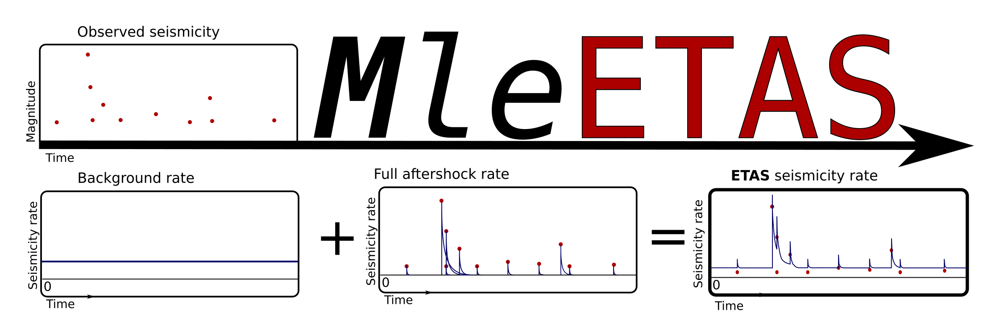

# Package MleETAS 
( Maximum Likelyhood Estimation of ETAS and ETASI )

A python package to fit and simulate the Epidemic Type Aftershock Sequence (ETAS) model in seismology (Ogata, 1988). 
Also include routines for the ETASI model of Hainzl (2021) (i.e.; take into account short term incompletness)

The parameter space estimation rely on the maximization of a likelyhood function trough scipy's L-BFGS-B optimization routine.

## Overview
The mleetas package contain 3 modules:

1. **mleetas.etas**:
    * A module to fit the classic ETAS model. 5 parameters: (A,c,p,al,mu)
3. **mleetas.etasi**:
    * A module to fit the ETASI model. A modified version of the classic ETAS to take into account a rate dependent incompletness effect (Hainzl; 2021). 7 parameters: (A,c,p,al,mu,b,Tb)
5. **mleetas.simulation**:
    * A module to generate synthetics ETAS and ETASI catalogs, stationary background catalogs, Gutenberg-Richter magnitude distribution and more.

for more detail, refer to the code documentation inside functions and the 2 example python file in the dir. "example/"

## Package installation
Download the repo wherever you like (Under the directory name mleetas/)

    git clone https://github.com/Luchorigami/mleetas.git

Install the package with pip

    pip install mleetas/

## Example
You can find examples to simulate and fit etas with the MleETAS package in the example dir.

Note: The L-BFGS-B Optimization often end with *ABNORMAL_TERMINATION_IN_LNSRCH*. This is probably due to numerical precision errors and likely require a fine tuning of the L-BFGS-B's parameters. Even with this unusual termination, we can confidently interpret the outputed ETAS(I) estimates because such numerical errors seems to happen very close to the convergence criterion. In other words: don't worry but make syntetic tests to be sure that the inversion recover approximatively the same parameters as the one used to generate the synthetic catalogs.  

## References

- Hainzl, S., 2021. ETAS-Approach Accounting for Short-Term Incompleteness of Earthquake Catalogs. Bulletin of the Seismological Society of America. https://doi.org/10.1785/0120210146

- Moutote, L., Itoh, Y., Lengliné, O., Duputel, Z., Socquet, A., 2023. Evidence of a Transient Aseismic Slip Driving the 2017 Valparaiso Earthquake Sequence, From Foreshocks to Aftershocks. Journal of Geophysical Research: Solid Earth 128, e2023JB026603. https://doi.org/10.1029/2023JB026603

- Moutote, L., Marsan, D., Lengliné, O., Duputel, Z., 2021. Rare occurrences of non‐cascading foreshock activity in Southern California. Geophys Res Lett 48, e2020GL091757. https://doi.org/10.1029/2020GL091757

- Zhuang, J., Harte, D., Werner, M.J., Hainzl, S., Zhou, S., 2012. Basic models of seismicity: Temporal models. Community Online Resource for Statistical Seismicity Analysis Theme V.

Luc Moutote

